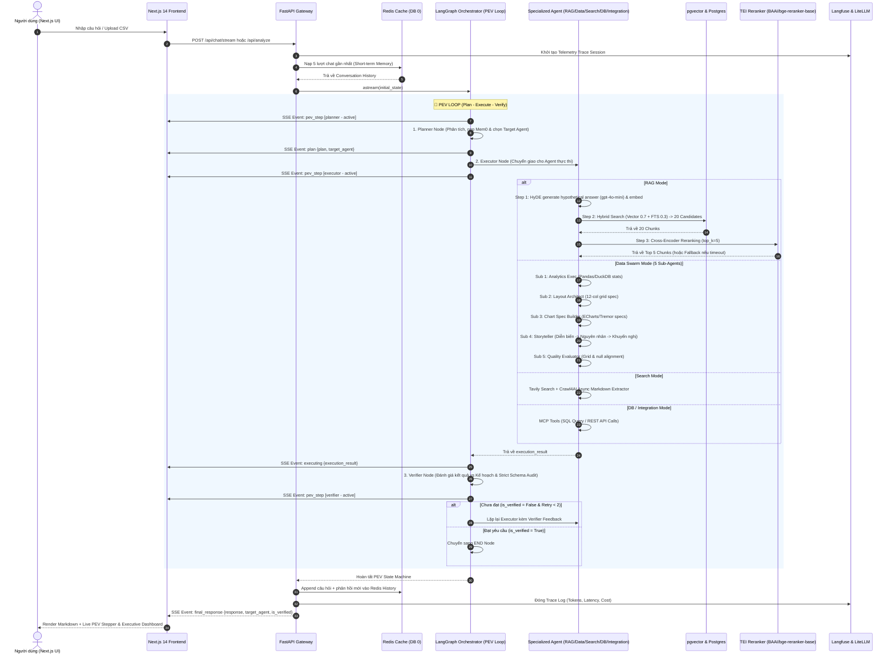

# 🏗️ SYSTEM ARCHITECTURE & WORKFLOW DOCUMENTATION
## Multi-Agent Enterprise System (4-Layer Framework)

Tài liệu này mô tả chi tiết toàn bộ kiến trúc tổng thể, luồng xử lý dữ liệu và các thành phần cốt lõi của hệ thống **Multi-Agent Enterprise** hỗ trợ Tra cứu tài liệu (RAG nâng cao với HyDE + Hybrid Search + Cross-Encoder Reranking), Phân tích dữ liệu tự trị (Data Analysis Swarm & Dynamic Dashboard), Tìm kiếm web thời gian thực (Real-time Search with Tavily & Crawl4AI), Truy vấn cơ sở dữ liệu (Database SQL via MCP) và Tích hợp API dịch vụ ngoài (Integration via MCP).

---

## 1. Tổng Quan Hệ Thống (System Overview)

Hệ thống được thiết kế theo chuẩn kiến trúc Doanh nghiệp (Enterprise-grade) dựa trên **Mô hình 4 Lớp (4-Layer Framework)**. Ứng dụng cung cấp khả năng tự trị cao thông qua vòng lặp **PEV (Plan - Execute - Verify)** điều khiển bởi **LangGraph**, tích hợp hạ tầng quản lý bộ nhớ hai tầng (Short-term Redis & Long-term Mem0), định tuyến LLM qua **LiteLLM / OpenRouter**, truyền phát sự kiện thời gian thực **SSE (Server-Sent Events)**, giám sát toàn diện với **Langfuse Observability V2**, và tinh lọc ngữ cảnh kết quả RAG bằng **HuggingFace TEI Cross-Encoder Reranker**.

### 🛠️ Công Nghệ Cốt Lõi (Tech Stack)

| Thành Phần | Công Nghệ / Thư Viện | Vai Trò & Mô Tả |
| :--- | :--- | :--- |
| **Primary Frontend UI** | `Next.js 14.2.3` (App Router), `React 18`, `TypeScript`, `TailwindCSS`, `Tremor`, `ECharts`, `AG-Grid React`, `DuckDB WASM` | Giao diện doanh nghiệp sản xuất tại `./frontend` (cổng `3001`). Hỗ trợ real-time SSE PEV Stepper, upload CSV kéo-thả, render Live Code & Executive Dashboard tương tác. |
| **Secondary Frontend UI** | `Streamlit >=1.36.0`, `AgGrid`, `Plotly` | Giao diện phụ/legacy tại `src/ui/app.py` (cổng `8501`) phục vụ kiểm thử nhanh bằng Python. |
| **API Gateway** | `FastAPI >=0.111.0`, `Uvicorn`, `sse-starlette`, `Pydantic v2` | Tiếp nhận HTTP/SSE Request, validate schema, quản lý lifecycle kết nối DB/Redis, nạp bộ nhớ ngắn hạn và truyền nhận luồng sự kiện PEV. |
| **Orchestrator** | `LangGraph >=0.1.5`, `LangChain Core` | Quản lý máy trạng thái tự trị (`StateGraph`), thực thi vòng lặp PEV (`Planner` -> `Executor` -> `Verifier`), tích hợp memory checkpointer (`MemorySaver`). |
| **LLM Proxy & Routing** | `LiteLLM >=1.40.0`, `OpenRouter API` | Proxy định tuyến mô hình chuẩn hóa (`openai/gpt-4o-mini`), tự động xử lý Failover, base URL và retry. |
| **Vector DB & Storage** | `PostgreSQL 16`, `pgvector`, `SQLAlchemy`, `asyncpg` | Lưu trữ dữ liệu hệ thống, bảng nhúng vector `rag_chunks` (1536 dims) với Cosine similarity & Full-Text Search. Phân chia schema `public` & `langfuse`. |
| **RAG Retrieval Engine** | `HyDE`, `Full-Text Search (FTS)`, `pgvector` | Tìm kiếm kết hợp (Hybrid Search = 0.7 * Vector Score + 0.3 * FTS Score) nâng cao độ chính xác truy vấn ngữ cảnh. |
| **Cross-Encoder Reranker** | `TEI (Text Embeddings Inference)`, `BAAI/bge-reranker-base` | Dịch vụ Reranker container độc lập (`agent_reranker`), tinh lọc 20 ứng viên Hybrid Search xuống Top 5 kết quả tối ưu nhất với cơ sở Graceful Fallback. |
| **Cache & Short-term Memory** | `Redis 5.0+`, `redis-py (async)` | Bộ nhớ đệm hội thoại theo phiên (Sliding window history 5 lượt chat). Phân chia DB 0 (Cache/Session) và DB 1 (Langfuse Worker Queue). |
| **Long-term Memory** | `Mem0ai >=0.1.0`, `MemoryManager` | Trích xuất và lưu vết sở thích, thói quen và ngữ cảnh của người dùng qua các phiên hội thoại. |
| **Observability & Tracing** | `Langfuse V2 SDK` (Self-hosted Web & Worker) | Tracking End-to-End telemetry, tính toán Token, Latency, Cost và trace cây thực thi của LLM/LangGraph. |
| **Search & Scraping** | `Tavily API`, `Crawl4AI >=0.4.0` | Tìm kiếm dữ liệu web thời gian thực và cào trích xuất nội dung Markdown bất đồng bộ. |
| **MCP Integration** | `Model Context Protocol (MCP)` | Giao thức kết nối chuẩn qua `MCPClient` cho `DatabaseAgent` (SQL queries) và `IntegrationAgent` (REST API). |

### 🌐 Các Endpoint API chính (FastAPI Gateway)

1. `POST /api/chat`: Xử lý hội thoại dạng JSON đồng bộ. Nạp lịch sử 5 lượt chat từ Redis, chuyển qua Orchestrator và lưu tin nhắn mới vào Redis. Trả về `ChatResponse` kèm trích dẫn `sources` và vết thực thi `pev_trace`.
2. `POST /api/chat/stream`: Truyền phát sự kiện PEV Loop qua **SSE (Server-Sent Events)** thời gian thực (`pev_step`, `plan`, `executing`, `verifying`, `final_response`, `error`).
3. `POST /api/analyze`: Multipart upload file CSV để tự động chạy EDA, phân tích thống kê và sinh cấu hình Executive Dashboard spec.
4. `GET /health`: Health-check xác nhận tình trạng hoạt động của API Gateway.

---

## 2. Sơ Đồ Luồng Hoạt Động (Workflow & Container Topology)

### 🐳 Topology 7 Services trong Docker Compose

```
                              ┌──────────────────────────────┐
                              │  agent_frontend (Port 3001)  │
                              │  Next.js 14 App Router UI    │
                              └──────────────┬───────────────┘
                                             │ HTTP / SSE Stream
                              ┌──────────────▼───────────────┐
                              │   agent_backend (Port 8000)  │
                              │       FastAPI Gateway        │
                              └─┬─────────┬─────────┬──────┬─┘
                                │         │         │      │
       ┌────────────────────────▼─┐     ┌─▼───────┐ │    ┌─▼──────────────┐
       │     agent_postgres       │     │ agent_  │ │    │ agent_reranker │
       │ (PostgreSQL 16+pgvector) │     │ redis   │ │    │ (TEI Reranker) │
       │   Port 5432 (agentdb)    │     │ Port    │ │    │  Port 8080:80  │
       └──────────────▲───────────┘     │ 6379    │ │    └────────────────┘
                      │                 └────▲────┘ │
                      │                      │      │
                      │  ┌───────────────────┴──────▼────────────────┐
                      └──┤ agent_langfuse_web (3005) & worker        │
                         │ Observability & Async Queue (DB 1 / schema)│
                         └───────────────────────────────────────────┘
```

### 🔄 Sơ Đồ Tuần Tự (Sequence Diagram - PEV Loop with SSE Streaming)



---

## 3. Phân Tích Kiến Trúc 4 Lớp (The 4-Layer Framework)

Dự án được chuẩn hóa theo thiết kế 4 lớp cho hệ thống Multi-Agent Doanh nghiệp:

```
┌────────────────────────────────────────────────────────────────────────┐
│                        LAYER 1: FRONT END                              │
│ Next.js 14 App Router • PEV Stepper • Executive Dashboard • AgGrid     │
│       ECharts • Tremor • DuckDB WASM • Streamlit UI (Legacy)           │
└──────────────────────────────────┬─────────────────────────────────────┘
                                   │
┌──────────────────────────────────▼─────────────────────────────────────┐
│                 LAYER 2: HARNESS & MEMORY (CONTROL CORE)               │
│ LangGraph PEV StateMachine • MemorySaver • Redis History • Mem0 Memory │
└──────────────────────────────────┬─────────────────────────────────────┘
                                   │
┌──────────────────────────────────▼─────────────────────────────────────┐
│                       LAYER 3: TOOLS & AGENTS                          │
│ RAGAgent (HyDE/Hybrid/TEI) • DataAnalystAgent (5 Sub-Agent Swarm)     │
│ SearchAgent (Tavily/Crawl4AI) • DBAgent (MCP SQL) • IntegrationAgent   │
└──────────────────────────────────┬─────────────────────────────────────┘
                                   │
┌──────────────────────────────────▼─────────────────────────────────────┐
│                   LAYER 4: GOVERNANCE & MONITORING                     │
│    LiteLLM Unified Proxy • Langfuse Telemetry • TEI Reranker Service   │
│            Database Schema Isolation (public vs langfuse)              │
└────────────────────────────────────────────────────────────────────────┘
```

### 🔹 Layer 1: Front End & User Experience
- **Primary Production UI (Next.js 14 App Router tại `./frontend`)**:
  - `PEVStepper.tsx` & `AgentThoughtStepper.tsx`: Hiển thị quy trình suy luận 3 bước của LangGraph thời gian thực.
  - `EnterpriseDashboard.tsx`: Render các KPI Card, biểu đồ ECharts/Tremor, và bảng dữ liệu AG-Grid từ JSON Spec.
  - `CSVUploader.tsx`: Upload file dữ liệu CSV trực tiếp tại Main Area.
  - `SourcesList.tsx`: Hiển thị nguồn trích dẫn tài liệu RAG chính xác.
  - `duckdb.ts`: Tích hợp DuckDB WASM chạy truy vấn SQL trực tiếp trên trình duyệt client.
- **Secondary UI (Streamlit tại `src/ui/app.py`)**:
  - Đầy đủ tính năng chat, chọn Agent thủ công, kéo thả CSV cho môi trường testing Python.

### 🔹 Layer 2: Harness & Memory (Lõi Điều Khiển)
- **LangGraph PEV State Machine**: Điều phối luồng làm việc tự trị thông qua `AgentState` TypedDict và checkpointer `MemorySaver` phân chia theo `thread_id` (`session_id`).
- **Short-term Memory (Bộ nhớ ngắn hạn)**: `RedisClient` quản lý danh sách tin nhắn theo cửa sổ trượt (Sliding Window 5 lượt hội thoại).
- **Long-term Memory (Bộ nhớ dài hạn)**: `MemoryManager` (tích hợp `Mem0ai`) lưu trữ sở thích và ngữ cảnh lịch sử người dùng, tự động nạp vào `Planner Node` để cá nhân hóa kết quả.

### 🔹 Layer 3: Tools & 5 Specialized Agents

1. **RAGAgent (`src/agents/rag_agent`)**:
   - **Kỹ thuật HyDE (Hypothetical Document Embeddings)**: Dùng `gpt-4o-mini` sinh văn bản giả định trước khi tạo vector embedding (`openai/text-embedding-3-small`).
   - **Hybrid Search**: Tìm kiếm kết hợp trên PostgreSQL (`pgvector` Cosine similarity x 0.7 + Full-Text Search `ts_rank_cd` x 0.3) lấy 20 ứng viên.
   - **TEI Cross-Encoder Reranking**: Gửi 20 ứng viên tới dịch vụ `agent_reranker` (HuggingFace TEI `bge-reranker-base`) để tinh lọc Top 5 chunks chất lượng nhất. Hỗ trợ Graceful Fallback trực tiếp về Hybrid Search nếu TEI timeout.

2. **DataAnalystAgent (`src/agents/data_agent`) — Multi-Agent Swarm Pipeline**:
   - **Sub-Agent 1 (Data Analytics Executor)**: Chạy mã Python an toàn (Pandas / DuckDB) tính toán hình dạng dữ liệu, kiểu dữ liệu, thống kê mô tả & KPIs.
   - **Sub-Agent 2 (Dashboard Layout Architect)**: Lập kế hoạch bố cục khung Dashboard hệ 12 cột (`col-span-12`, `col-span-7`, `col-span-5`).
   - **Sub-Agent 3 (Chart Spec Builder)**: Sinh chi tiết cấu hình biểu đồ (ECharts, Tremor, Recharts) kèm ép kiểu dữ liệu chuẩn.
   - **Sub-Agent 4 (Executive Storyteller)**: Tổng hợp báo cáo kinh doanh 3 phần: *Diễn Biến -> Nguyên Nhân -> Khuyến Nghị*.
   - **Sub-Agent 5 (Verifier & Evaluator Node)**: Đánh giá căn chỉnh grid 12 cột, kiểm tra lỗi null/NaN và kiểm tra toàn vẹn key mapping.

3. **SearchAgent (`src/agents/search_agent`)**:
   - **Tavily Search API**: Tìm kiếm nhanh các liên kết web thời gian thực.
   - **Crawl4AI Async Crawler**: Cào dữ liệu chuyên sâu song song và trích xuất Markdown chuẩn.

4. **DatabaseAgent (`src/agents/db_agent`)**:
   - Thực thi câu lệnh SQL an toàn thông qua `MCPClient` (Model Context Protocol).

5. **IntegrationAgent (`src/agents/integration_agent`)**:
   - Gọi REST API tích hợp các dịch vụ bên ngoài thông qua `MCPClient`.

### 🔹 Layer 4: Governance & Monitoring
- **LiteLLM Router**: Chuẩn hóa toàn bộ lời gọi LLM về API OpenRouter (`openai/gpt-4o-mini`).
- **TEI Reranker Service**: Container dịch vụ `agent_reranker` (`ghcr.io/huggingface/text-embeddings-inference:cpu-1.2`) phục vụ chấm điểm ngữ cảnh cross-encoder tốc độ cao.
- **Langfuse Telemetry V2**: Tích hợp sâu qua `LLMClient` theo dõi token, latency, chi phí và trace cây thực thi của từng node.
- **Database Schema Isolation**: Phân chia không gian lưu trữ PostgreSQL thành schema `public` (dành cho RAG `rag_chunks`) và schema `langfuse` (dành cho Langfuse Prisma migration), khắc phục triệt để lỗi Prisma P3005.

---

## 4. Các Luồng Xử Lý Cốt Lõi (Core Mechanics Deep Dive)

### 🔄 Chu Trình PEV Loop (Plan - Execute - Verify)

```
[Start] ──► (Planner Node) ──► (Executor Node) ──► (Verifier Node)
                                     ▲                     │
                                     │   is_verified=False │
                                     └─────────────────────┴──► (END Node)
                                          (Retry < 2)        is_verified=True
```

1. **Planner Node**:
   - Phân tích câu hỏi, nạp bộ nhớ dài hạn `Mem0`.
   - Lập kế hoạch xử lý (`plan`) và chọn `target_agent`. Hỗ trợ ép chế độ (`agent_mode`) hoặc tự động định tuyến khi có file CSV.
2. **Executor Node**:
   - Lấy Agent tương ứng từ `AgentRegistry`.
   - Thực thi `process_request()` hoặc `process_csv_request()`. Tiếp nhận phản hồi điều chỉnh `verifier_feedback` nếu lặp lại.
3. **Verifier Node & Strict Schema Audit**:
   - Đánh giá chất lượng đầu ra so với kế hoạch ban đầu.
   - **Strict Schema Audit (`verify_dashboard_spec`)**: Đối với kết quả phân tích CSV, Verifier chạy kiểm tra đối chiếu 100% tên trường trong Dashboard spec với các cột thực tế của Pandas DataFrame để loại bỏ hoàn toàn hiện tượng suy đoán chỉ số ảo (hallucinated metrics).
   - Cho phép thử lại tối đa 2 lần (`max_retries = 2`).

### 📦 Structure Trạng Thái Ngữ Cảnh (`AgentState`)

```python
class AgentState(TypedDict, total=False):
    query: str                     # Câu hỏi gốc của người dùng
    session_id: str                # Correlation ID định danh phiên
    csv_content: Optional[str]     # Nội dung file CSV đính kèm
    csv_filename: Optional[str]    # Tên file CSV
    agent_mode: Optional[str]      # Chế độ ép Agent từ UI (nếu có)
    messages: list[dict[str, str]] # Lịch sử hội thoại
    team_memory: dict[str, Any]    # Bộ nhớ chia sẻ giữa các agent
    plan: str                      # Kế hoạch do Planner tạo
    target_agent: str              # Agent được phân công
    execution_result: str          # Kết quả thô từ Agent
    final_response: str            # Phản hồi hoàn chỉnh cuối cùng
    is_verified: bool              # Trạng thái kiểm duyệt
    verifier_feedback: str         # Phản hồi điều chỉnh nếu bị reject
    retry_count: int               # Số lần đã thử lại
    max_retries: int               # Số lần thử lại tối đa (Mặc định: 2)
```

---

## 5. Triển Khai & Khắc Phục Sự Cố (Deployment & Troubleshooting)

### 🐳 Danh Sách Container (Docker Compose - 7 Services)

| Container Name | Service Key | Image / Build | Port Mapping | Chức Năng |
| :--- | :--- | :--- | :--- | :--- |
| `agent_postgres` | `postgres` | `ankane/pgvector:latest` | `5432:5432` | PostgreSQL DB + pgvector extension |
| `agent_redis` | `redis` | `redis:alpine` | `6379:6379` | Redis Cache (DB 0: Short-term, DB 1: Langfuse) |
| `agent_backend` | `backend` | `Dockerfile` (FastAPI) | `8000:8000` | FastAPI Gateway & LangGraph Orchestrator |
| `agent_frontend` | `frontend` | `./frontend` (Next.js 14) | `3001:3000` | Next.js 14 App Router UI chính |
| `agent_langfuse_web` | `langfuse-web` | `langfuse/langfuse:2` | `3005:3000` | Giao diện giám sát Observability |
| `agent_langfuse_worker` | `langfuse-worker` | `langfuse/langfuse-worker:2` | N/A | Worker xử lý hàng đợi bất đồng bộ Langfuse |
| `agent_reranker` | `tei-reranker` | `text-embeddings-inference:cpu-1.2` | `8080:80` | TEI Cross-Encoder Reranker Service |

### 🛠️ Nhật Ký Xử Lý Lỗi Thường Gặp (Troubleshooting Log)

1. **Lỗi Prisma Migration P3005 (`Langfuse Container Crash`)**:
   - *Nguyên nhân*: Prisma tìm thấy schema `public` đã chứa bảng RAG `rag_chunks`.
   - *Giải pháp*: Cấu hình `DATABASE_URL` và `DIRECT_URL` của Langfuse dùng `schema=langfuse` trong `docker-compose.yml`.
2. **Cảnh báo Redis User Default AUTH (`[WARN] This Redis server's default user...`)**:
   - *Nguyên nhân*: Container Redis chạy không mật khẩu nhưng client ioredis của Langfuse mặc định truyền chuỗi auth.
   - *Giải pháp*: Đây chỉ là cảnh báo (`WARN`), ứng dụng vẫn hoạt động 100% bình thường. Nếu muốn xóa log, bổ sung `--requirepass` trong service `redis` của `docker-compose.yml`.
3. **Lỗi TEI Reranker Timeout / Unavailable**:
   - *Nguyên nhân*: Service `agent_reranker` đang nạp mô hình `BAAI/bge-reranker-base` hoặc bị quá tải.
   - *Giải pháp*: Hàm `rerank_documents` trong `src/shared/reranker_client.py` có cơ chế Graceful Fallback tự động trả kết quả trực tiếp từ Hybrid Search.
4. **Lỗi LiteLLM Routing 401 Unauthorized**:
   - *Nguyên nhân*: Tên mô hình thiếu tiền tố `openai/` khiến LiteLLM định tuyến nhầm sang endpoint gốc của OpenAI.
   - *Giải pháp*: Đảm bảo cài đặt `OPENROUTER_MODEL=openai/gpt-4o-mini`.

---
*Tài liệu được đồng bộ và cập nhật tự động theo mã nguồn hiện tại của hệ thống.*
