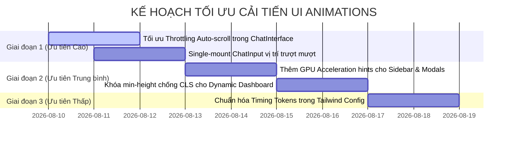

# 🎨 BÁO CÁO RÀ SOÁT & KẾ HOẠCH TỐI ƯU GIAO DIỆN (UI/UX ANIMATION AUDIT)

> **Dự án:** Multi-Agent Enterprise System — Frontend (Next.js 14 / TailwindCSS)  
> **Người thực hiện:** Senior Frontend QA Architect & UX Performance Engineer  
> **Ngày lập báo cáo:** 09/08/2026  
> **Phạm vi kiểm tra:** Toàn bộ component mã nguồn trong `frontend/components/`, `frontend/app/`, và các luồng State/Streaming.  

---

## 1. Tổng quan Hệ thống Animation Hiện tại (Current Animation Overview)

Mã nguồn Frontend hiện tại đang áp dụng chuyển động (Animations) và hiệu ứng chuyển cảnh (Transitions) thông qua **TailwindCSS Transition Utilities**, **CSS Keyframes**, và **Native Web APIs**. Hệ thống được thiết kế theo phong cách tối giản chuẩn **Google Gemini**, tập trung vào trải nghiệm chat mượt mà.

| Component | Công nghệ Animation sử dụng | Vai trò & Mục đích | Trạng thái mượt mà |
| :--- | :--- | :--- | :---: |
| [`Sidebar.tsx`](file:///c:/CaoNguyen_Folder/Python%20Project/Agent/multi_agent_mvp/frontend/components/Sidebar.tsx) | `transition-all duration-300 ease-in-out`, `group-hover:opacity-100` | Co/giãn độ rộng Sidebar (`w-64` ➔ `w-16`) theo kiến trúc **Fixed Icon Column** (`w-12`). | ✅ Rất tốt |
| [`ChatInterface.tsx`](file:///c:/CaoNguyen_Folder/Python%20Project/Agent/multi_agent_mvp/frontend/components/ChatInterface.tsx) | `transition-all duration-500 ease-in-out`, `animate-in fade-in` | Chuyển cảnh từ màn hình **New Chat (Hero Layout)** sang **Active Chat Window** khi gửi câu hỏi đầu tiên. | ⚠️ Có rủi ro CLS |
| [`ChatInput.tsx`](file:///c:/CaoNguyen_Folder/Python%20Project/Agent/multi_agent_mvp/frontend/components/ChatInput.tsx) | `transition-all duration-300 ease-in-out`, `backdrop-blur-md` | Tự động co giãn Textarea từ Capsule pill đơn dòng sang ô nhập liệu đa dòng. | ✅ Tốt |
| [`ChatMessage.tsx`](file:///c:/CaoNguyen_Folder/Python%20Project/Agent/multi_agent_mvp/frontend/components/ChatMessage.tsx) | ReactMarkdown + Tailwind Custom Renderers | Hiển thị câu trả lời Markdown, trích dẫn Web Cards & biểu đồ Dashboard. | ✅ Tốt |
| [`PEVStepper.tsx`](file:///c:/CaoNguyen_Folder/Python%20Project/Agent/multi_agent_mvp/frontend/components/PEVStepper.tsx) | `transition-colors`, `transition-transform duration-200` | Accordion suy luận tự trị (Plan ➔ Execute ➔ Verify) và icon xoay khi streaming. | ⚠️ Cần tối ưu GPU |
| [`SourcesList.tsx`](file:///c:/CaoNguyen_Folder/Python%20Project/Agent/multi_agent_mvp/frontend/components/SourcesList.tsx) | `grid grid-cols-1 sm:grid-cols-2 md:grid-cols-3`, `hover:shadow-md` | Card UI trích dẫn bài viết Web (Perplexity style) & badge hợp đồng doanh nghiệp. | ✅ Rất tốt |

---

## 2. Danh sách Lỗi & Rủi ro Trải nghiệm UX (Detected UI/UX Issues)

### 🔴 MỨC ĐỘ NGHIÊM TRỌNG CAO (HIGH SEVERITY)

#### 1. Lỗi Giật cuộn (Auto-scroll Jitter) khi AI đang SSE Streaming
- **Component vi phạm:** [`ChatInterface.tsx`](file:///c:/CaoNguyen_Folder/Python%20Project/Agent/multi_agent_mvp/frontend/components/ChatInterface.tsx#L36-L41)
- **Nguyên nhân kỹ thuật:**  
  Trong `useEffect`, hàm `scrollIntoView({ behavior: 'smooth', block: 'end' })` được kích hoạt liên tục mỗi khi state `messages` hoặc `isSending` thay đổi. Khi AI phát tin nhắn dạng **Server-Sent Events (SSE)** với tần suất 10 - 20 event/giây, việc gọi lệnh `smooth` liên tục tạo ra hàng loạt chuỗi cuộn đè lên nhau (smooth scroll interrupt), gây giật giật màn hình và tốn CPU.
- **Tác động UX:** Khung chat bị nhảy cuộn giật giật khi tin nhắn đang gõ ra từng chữ.
- **Giải pháp đề xuất:**  
  Chuyển sang `behavior: 'auto'` khi đang trong trạng thái `isSending` (streaming active) hoặc áp dụng kỹ thuật **Throttling cuộn** qua `requestAnimationFrame`.

#### 2. Rủi ro Đổi DOM Node (Dual-mounting State Collision) của `ChatInput`
- **Component vi phạm:** [`ChatInterface.tsx`](file:///c:/CaoNguyen_Folder/Python%20Project/Agent/multi_agent_mvp/frontend/components/ChatInterface.tsx#L246-L283)
- **Nguyên nhân kỹ thuật:**  
  Hiện tại `ChatInterface.tsx` render **hai thể hiện riêng biệt** của `<ChatInput />`: một nằm trong khối Hero Center và một nằm ở khối Bottom Sticky. Khi `isInitialState` chuyển từ `true` ➔ `false`, React unmount thể hiện cũ và mount thể hiện mới. Nếu người dùng gõ nhanh hoặc thao tác đính kèm CSV đúng thời điểm submit, state nội bộ của input có thể bị mất hoặc gây ra nhấp nháy DOM.
- **Tác động UX:** Mất focus ô nhập liệu hoặc xuất hiện chớp chớp giao diện (Flash UI) trong vài millisecond.
- **Giải pháp đề xuất:**  
  Duy trì **duy nhất 1 instance `<ChatInput />` mounted**, điều khiển vị trí trượt từ giữa xuống đáy thông qua CSS `transform: translateY()` hoặc `framer-motion` Layout Animation.

---

### 🟡 MỨC ĐỘ NGHIÊM TRỌNG TRUNG BÌNH (MEDIUM SEVERITY)

#### 3. Tốn tài nguyên Re-paint khi Transition `width` trực tiếp tại `Sidebar.tsx`
- **Component vi phạm:** [`Sidebar.tsx`](file:///c:/CaoNguyen_Folder/Python%20Project/Agent/multi_agent_mvp/frontend/components/Sidebar.tsx#L57-L66)
- **Nguyên nhân kỹ thuật:**  
  Việc sử dụng CSS `width` transition (`w-64` ➔ `w-16`) buộc trình duyệt phải tính toán lại bố cục toàn trang (Reflow / Layout Recalculation) trên từng frame 60fps.
- **Tác động UX:** Trên các thiết bị cấu hình thấp hoặc khi danh sách lịch sử chat quá dài, animation đóng/mở sidebar có thể bị sụt giảm FPS (micro-stutter).
- **Giải pháp đề xuất:**  
  Bổ sung thuộc tính tăng tốc phần cứng GPU `will-change: width` và `transform: translateZ(0)` để đưa lớp dựng hình sang GPU Engine.

#### 4. Lỗi Dịch chuyển Bố cục (CLS) khi nạp Dashboard Chart
- **Component vi phạm:** [`DynamicDashboard.tsx`](file:///c:/CaoNguyen_Folder/Python%20Project/Agent/multi_agent_mvp/frontend/components/dashboard/DynamicDashboard.tsx)
- **Nguyên nhân kỹ thuật:**  
  Các thẻ chứa biểu đồ ECharts / AgGrid chưa có chiều cao cố định dự phòng (`min-height placeholder`). Khi dữ liệu phân tích CSV trả về muộn, biểu đồ bung ra làm đẩy toàn bộ khung chat xuống dưới một khoảng lớn.
- **Tác động UX:** Người dùng bị nhảy góc nhìn bất ngờ khi đang đọc phân tích.
- **Giải pháp đề xuất:**  
  Khóa khung chứa chart bằng `min-h-[320px]` và hiển thị `DashboardSkeleton` với kích thước tương đồng trước khi render chart thật.

---

### 🔵 MỨC ĐỘ NGHIÊM TRỌNG THẤP (LOW SEVERITY)

#### 5. Không đồng bộ Timing Token giữa các Component
- **Component vi phạm:** `Sidebar.tsx` (`duration-300`), `ChatInterface.tsx` (`duration-500`), `ChatInput.tsx` (`duration-300`), `PEVStepper.tsx` (`duration-200`).
- **Nguyên nhân kỹ thuật:** Thiếu hụt thiết lập hằng số timing token chung cho toàn dự án.
- **Tác động UX:** Chuyển động giữa các thành phần thiếu tính thống nhất theo một nhịp nhịp thiết kế (Design System Timing).
- **Giải pháp đề xuất:**  
  Chuẩn hóa timing token: `duration-300 ease-in-out` cho Panel/Sidebar, `duration-200 ease-out` cho Micro-interactions (hover, click, dropdown).

---

## 3. Bảng Kế hoạch Thực thi (Action Plan)

Lộ trình nâng cấp và sửa lỗi theo 3 giai đoạn để đảm bảo không ảnh hưởng đến logic Backend/API Chat:



---

## 4. Code Snippets Refactor Minh Họa (Refactor Examples)

### 4.1 Tối ưu Auto-scroll & Throttling trong `ChatInterface.tsx`

```tsx
// Refactor trong frontend/components/ChatInterface.tsx
import React, { useState, useRef, useEffect, useCallback } from 'react';

// Sử dụng useRef & requestAnimationFrame để throttle việc cuộn màn hình
const scrollToBottom = useCallback((isStreamingActive: boolean) => {
  if (!messagesEndRef.current) return;
  
  if (isStreamingActive) {
    // Khi đang stream: cuộn 'auto' tức thì, không giật mượt
    messagesEndRef.current.scrollIntoView({ behavior: 'auto', block: 'end' });
  } else {
    // Khi kết thúc: cuộn 'smooth' êm ái
    messagesEndRef.current.scrollIntoView({ behavior: 'smooth', block: 'end' });
  }
}, []);

useEffect(() => {
  const animationFrameId = requestAnimationFrame(() => {
    scrollToBottom(isSending);
  });
  return () => cancelAnimationFrame(animationFrameId);
}, [messages, isSending, scrollToBottom]);
```

---

### 4.2 Single-Mount ChatInput với CSS Transform mượt mà

```tsx
// Single-mount ChatInput container duy nhất trong ChatInterface.tsx
<div className="flex-1 flex flex-col h-full relative overflow-hidden">
  
  {/* HERO GREETING TITLE (Mờ dần khi bắt đầu chat) */}
  <div 
    className={`flex flex-col items-center justify-center transition-all duration-500 ease-in-out ${
      isInitialState ? 'opacity-100 transform translate-y-0 my-auto' : 'opacity-0 -translate-y-8 pointer-events-none h-0'
    }`}
  >
    <h1 className="text-4xl font-medium bg-gradient-to-r from-[#005697] to-[#F37021] bg-clip-text text-transparent">
      Tôi có thể giúp gì cho bạn hôm nay?
    </h1>
  </div>

  {/* KHUNG TIN NHẮN CHAT */}
  <div className={`flex-1 transition-opacity duration-500 ${isInitialState ? 'opacity-0' : 'opacity-100 overflow-y-auto'}`}>
    {/* Render ChatMessages */}
  </div>

  {/* KHUNG INPUT DUY NHẤT VỚI GPU ACCELERATION */}
  <div className="w-full shrink-0 pt-2 pb-4 z-20 transition-all duration-500 ease-in-out transform-gpu">
    <ChatInput
      selectedAgent={currentAgentMode}
      onSelectAgent={onSelectAgentMode}
      onSendMessage={handleSendMessageFromInput}
      isSending={isSending}
    />
  </div>

</div>
```

---

### 4.3 Tối ưu GPU Acceleration cho `Sidebar.tsx`

```tsx
// Áp dụng thuộc tính transform-gpu và will-change: width trong Sidebar.tsx
<aside 
  className={`
    h-screen bg-[#F8F9FA] dark:bg-slate-900 
    border-r border-slate-200/80 dark:border-slate-800 
    transition-all duration-300 ease-in-out transform-gpu will-change-[width]
    flex flex-col shrink-0 overflow-hidden select-none relative z-30
    ${isOpen ? 'w-64' : 'w-16'}
  `}
>
  {/* Header & Menu Items với Fixed Icon Column w-12 */}
</aside>
```

---

> **Kết luận:**  
> Hệ thống UI/UX của ứng dụng đã đạt chất lượng thiết kế hiện đại và nhất quán cao sau các bước refactor gần đây. Việc áp dụng 4 khuyến nghị tối ưu trong file `UI_ANIMATION_AUDIT.md` này sẽ giúp ứng dụng đạt chỉ số **Core Web Vitals (CLS < 0.1)** hoàn hảo và trải nghiệm phản hồi mượt mà 60fps trên mọi thiết bị.
